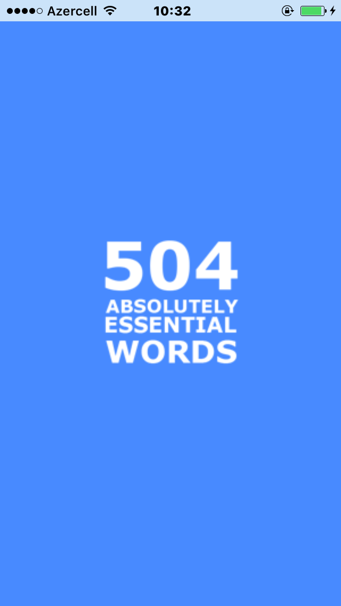
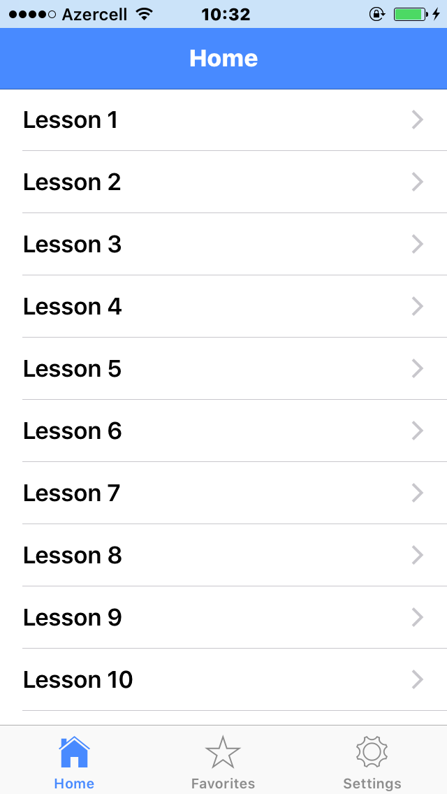
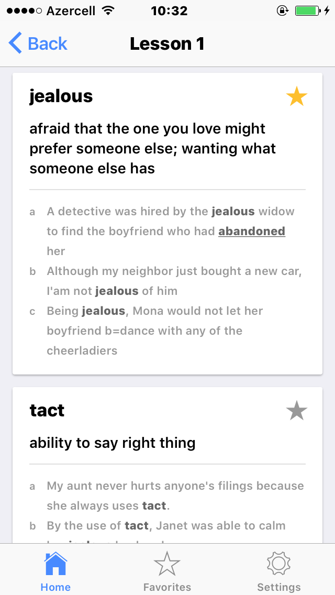
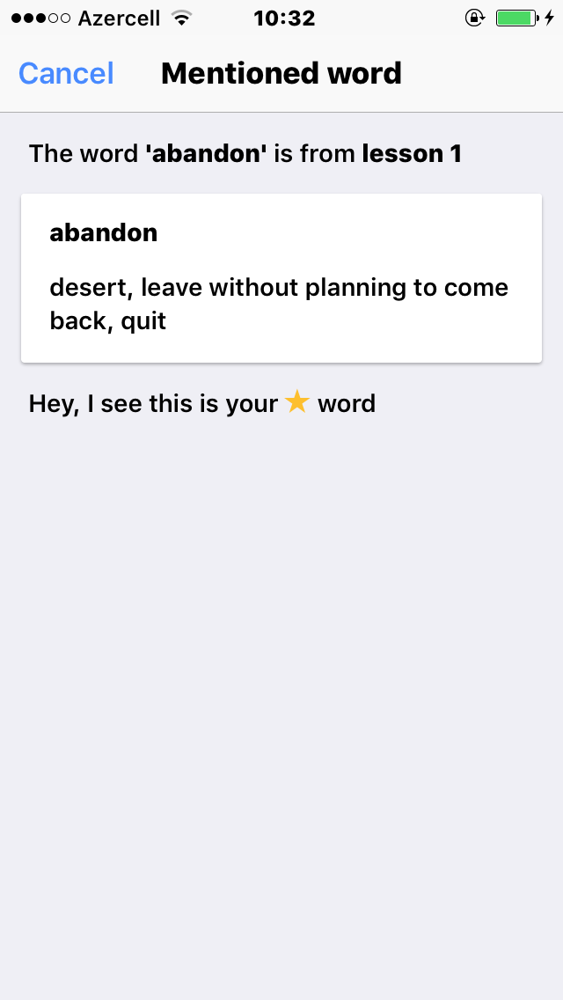
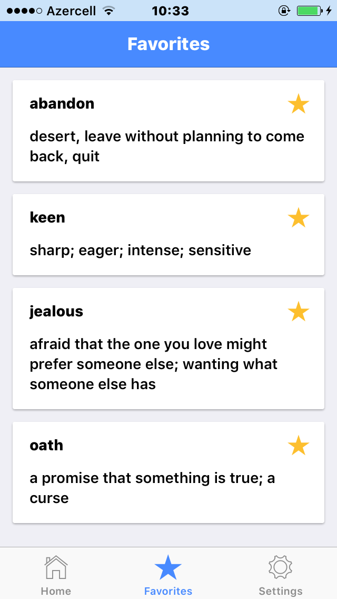
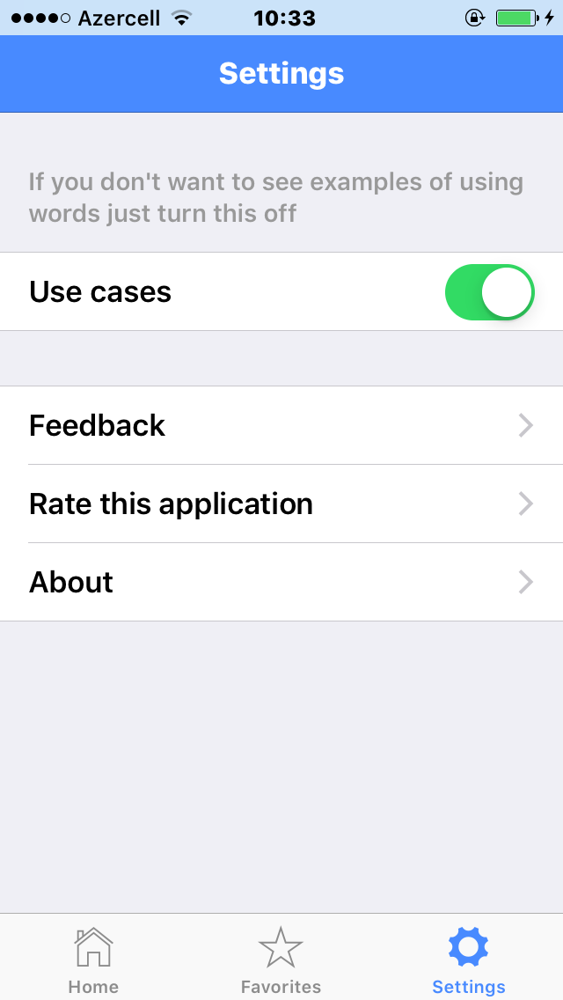
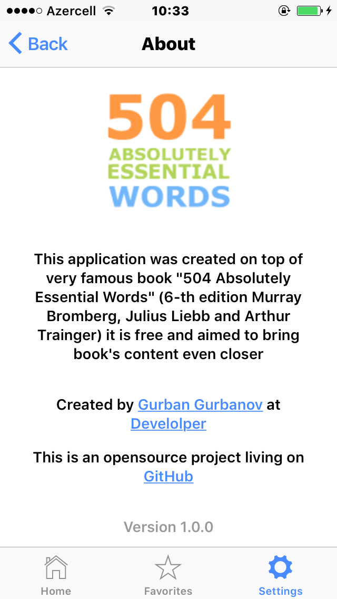
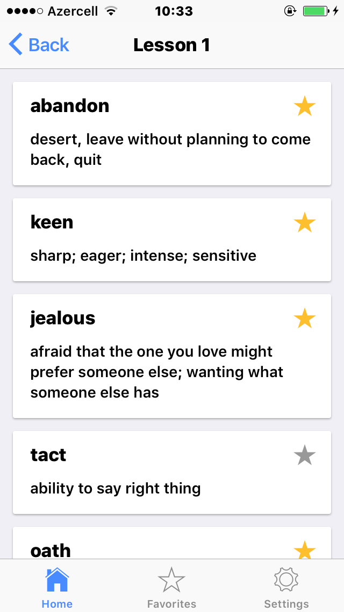

Run command `ionic serve --lab` in order to launch in browser

Run `ionic link` to bind running app with once on the Ionic cloud

Then after binding run `ionic upload` to upload

Screenshots

